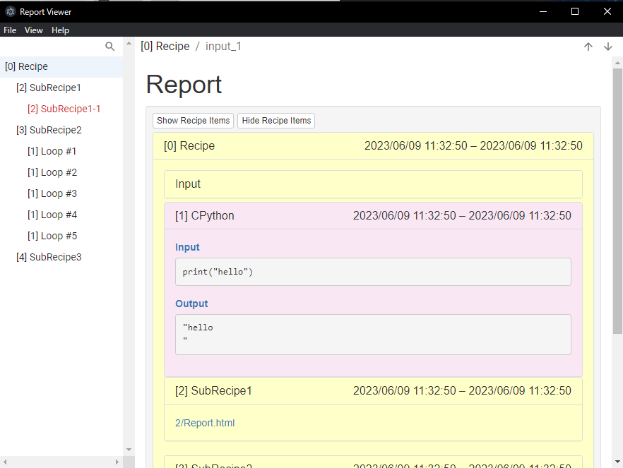
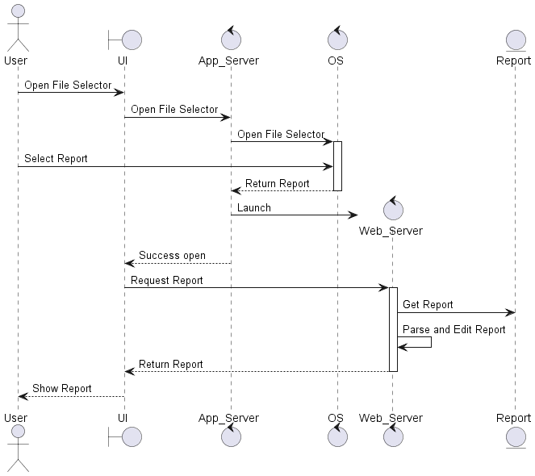
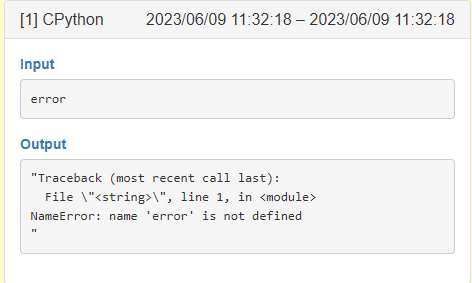
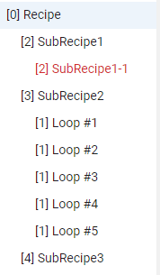

# Automation Center Report Viewer の紹介

## EMシステム トピック紹介

2023-06-15
濱田 伸一郎

---

## 今回のテーマ

- 業務の改善と実験を兼ねたツール開発事例の紹介
- 手軽にネイティブアプリが開発できるフレームワーク Electron の紹介

---

## Report Viewer

- Automation Center の出力する Report を閲覧しやすくするツール

### Features

- 任意 or 最新レポートの表示
- ネストされたサブレシピのツリー表示
- エラーが起きたレシピのハイライト
- アクティビティ間移動
- Automation Center でレシピを開く



---

## アーキテクチャ

- 主に3つの要素で成り立っている
  - UI プロセス: UI の描画
  - Application Server: Web Server と UI の仲介・OS 由来の API 実行
  - Web Server: Report の解析
- Electron のフレームワークに乗っかることですべての構成を TypeScript で実装可能


---

## 補足: 採用技術について

### node.js

Server 用の JavaScript ランタイム
ブラウザ以外でも JavaScript が実行できるようになる

### TypeScript

動的型付け言語の JavaScript を C# のように静的な型付けを行った派生言語

### React

JavaScript で UI を構築するためのライブラリ

### Electron

Node.js でデスクトップアプリケーションを開発できるフレームワーク
html/css/js で UI が構築できる

---

## 機能紹介

---

## レポートファイルの表示: Web Server

- レポートファイルの表示には静的ファイルを配信する簡易 Web Server を採用
  - アプリから Web Server へ http 通信でレポートを取得・表示
- Web Server 上ではレポートファイルの解析・整形を行う



---

## レポートファイルの解析: サブレシピの Tree 化

- ファイル・フォルダ名だとなにか分からないので、いちいち開く必要があった

```shell
Report.html
|- 2/
  |- Report.html
  |- 2/
    |- Report.html
|- 3/
  |- Report.html
  |- 3-1/
    |- Report.html
...
```

---

## レポートファイルの解析: サブレシピの Tree 化 2

- ディレクトリを再帰的に探索して、レポートファイルの木構造を作った
  - Report.html があれば、レシピ名を `report.title` に保存
  - ファイル内にエラーメッセージがあれば `report.error = true`
  - ルートディレクトリからの相対パスを `href` に保存
  - サブディレクトリがあれば中身の Report.html の情報を `children` 配列に追加

```typescript
// data model
{
  report: {
    title: string,
    error: boolean
  },
  href: string
  children?: Array<this>
}
```

---

## レシピのエラー判定

- レポート内にエラーが起きたかどうかの判定は含まれていないので、自前で解析
- 各アクティビティの Output の内容を解析して、キーワードが含まれているか確認
  - キーワードは C#, Python の例外メッセージとした



- Output の内容はスクレイピングの要領で html を検索

---

## レシピエラー画像



---

## Automation Center でレシピを開く

- Report の中身を見てレシピを修正したいときに使う想定
  - ※Report 内にレシピ情報が残っていないので、別の場所に移動されると機能しない

### レシピの特定方法

- Report のデフォルトの出力先から推測
- Automation Center は設定に従って以下にレポートを保存する
- `{OutputDir}\Report\Local\{RecipePath}\YYYYMMDDHHmmSSfff_{process_id}\`
- この設定に従った場所に保存されている場合のみ `{RecipePath}` を抽出してレシピを開く

---

## デモンストレーション

---

## 補足資料

---

## Issue Report 機能

- バグ報告を忘れないように、アプリ上に報告機能を用意した
  - 自分用でもあるし、配布したとき用でもある
- 送信ボタンを押すと GitHub API を叩いて Issue を作成し通知を送る仕組み


